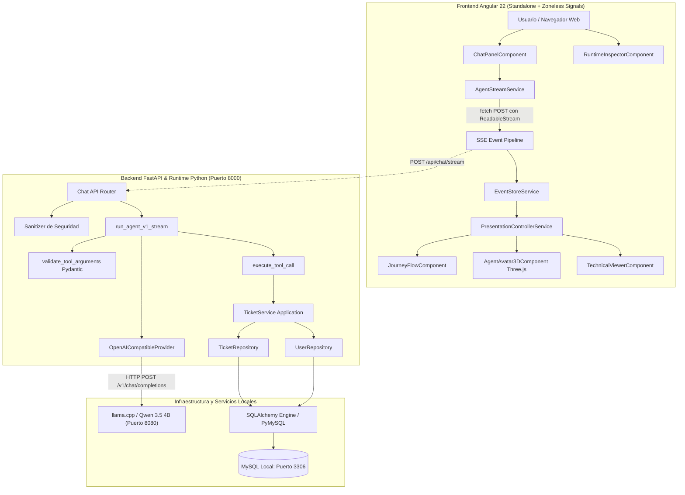
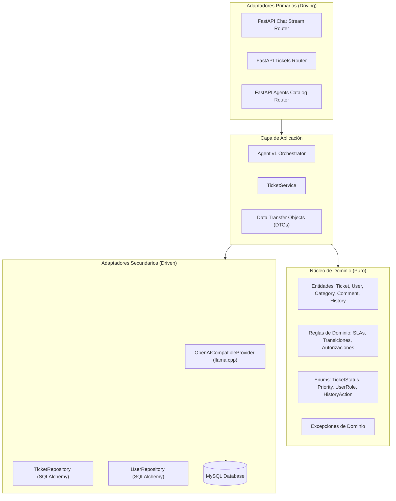
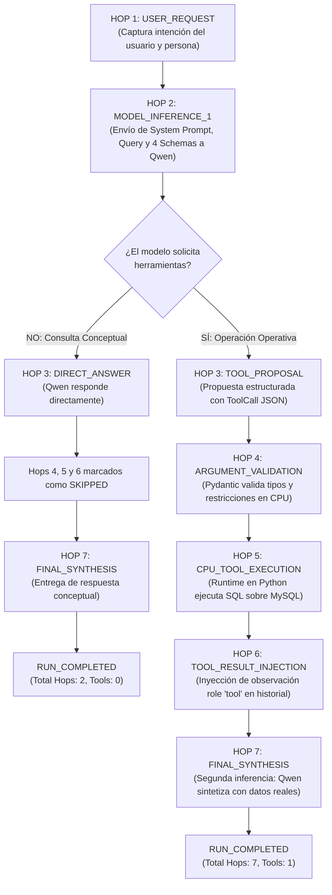
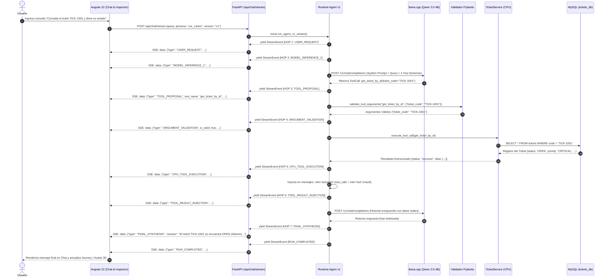
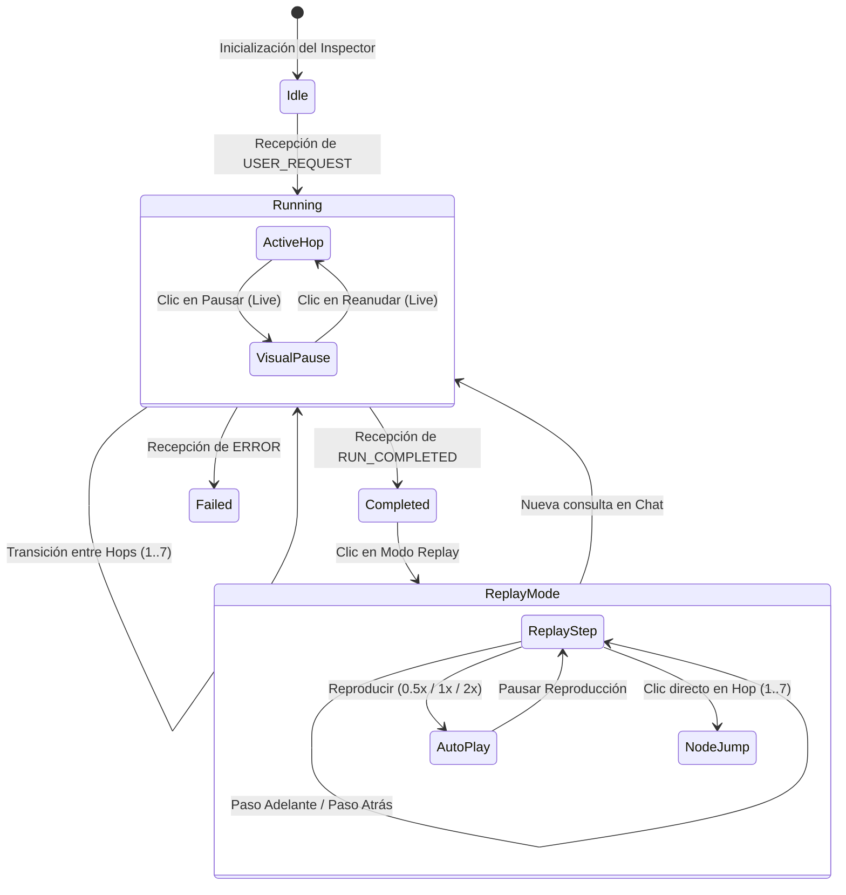
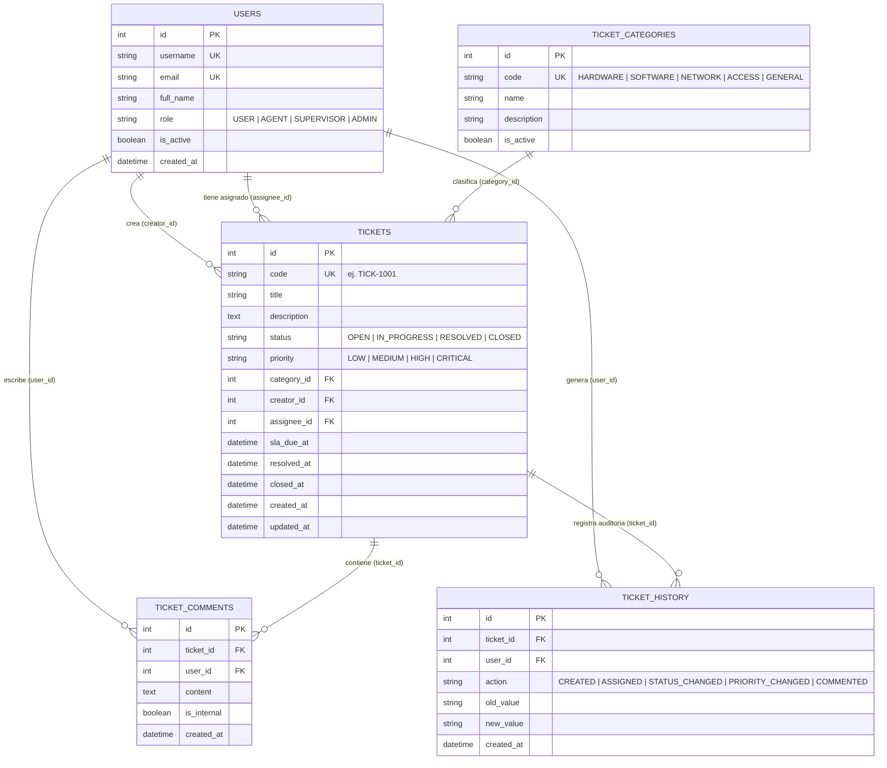

# Agent Engineering Playground

> **Plataforma arquitectónica, interactiva y pedagógica para la comprensión y observabilidad de sistemas agénticos paso a paso.**  
> Construida con arquitectura hexagonal, Server-Sent Events (SSE), modelo local Qwen mediante llama.cpp, persistencia transaccional en MySQL y un Runtime Inspector interactivo 3D desarrollado con Angular 22 y Three.js.

---

## 📑 Tabla de Contenidos

1. [Presentación del Proyecto](#1-presentación-del-proyecto)
2. [Capacidades Implementadas](#2-capacidades-implementadas)
3. [Arquitectura General](#3-arquitectura-general)
4. [Arquitectura Hexagonal y Estructura de Capas](#4-arquitectura-hexagonal-y-estructura-de-capas)
5. [Ciclo Completo de Agent v1: Las Siete Fases](#5-ciclo-completo-de-agent-v1-las-siete-fases)
6. [Diagrama de Secuencia End-to-End](#6-diagrama-de-secuencia-end-to-end)
7. [Contrato de Herramientas](#7-contrato-de-herramientas)
8. [SSE y Observabilidad de Ejecución](#8-sse-y-observabilidad-de-ejecución)
9. [Runtime Inspector y Experiencia 3D](#9-runtime-inspector-y-experiencia-3d)
10. [Persistencia MySQL y Modelo de Datos](#10-persistencia-mysql-y-modelo-de-datos)
11. [Guía de Instalación Reproducible](#11-guía-de-instalación-reproducible)
12. [Pruebas y Validaciones Automatizadas](#12-pruebas-y-validaciones-automatizadas)
13. [Evolución de Agent v1 a Agent v6](#13-evolución-de-agent-v1-a-agent-v6)
14. [Naturaleza de los Datos y Seguridad Documental](#14-naturaleza-de-los-datos-y-seguridad-documental)
15. [Glosario Técnico de Ingeniería de Agentes](#15-glosario-técnico-de-ingeniería-de-agentes)

---

## 1. Presentación del Proyecto

### 1.1 Propósito y Visión
El **Agent Engineering Playground** es un entorno de desarrollo e investigación creado para desmitificar el funcionamiento de los agentes de inteligencia artificial. En lugar de tratar al modelo de lenguaje como una caja negra inaccesible que produce texto de manera opaca, esta plataforma permite observar, auditar y estudiar **la cadena causal completa de ejecución**: qué solicitó el usuario, cuándo interviene el modelo, qué herramienta decide utilizar, cómo valida los tipos el runtime local, qué consultas se despachan contra la base de datos y cómo se sintetiza la respuesta final respaldada en evidencia real.

### 1.2 Público Objetivo
* **Ingenieros de Software y Arquitectos:** Que buscan comprender los límites de soberanía entre el software tradicional determinista y los modelos probabilísticos de lenguaje.
* **Ingenieros de IA y Agentes:** Que requieren patrones reproducibles de orquestación, contratos de herramientas tipados y observabilidad en tiempo real.
* **Instructores y Estudiantes:** Que necesitan un entorno visual interactivo donde la teoría de inferencia, llamadas a herramientas y síntesis *grounded* pueda palparse en tiempo real y reproducirse paso a paso.

### 1.3 Chatbot Convencional vs. Agente con Herramientas
Un **chatbot conversacional tradicional** opera en un circuito cerrado texto-a-texto: recibe un prompt y genera texto predictivo basado exclusivamente en los pesos de su entrenamiento estático, susceptible a desactualización y alucinación factual.

Por el contrario, un **agente con herramientas (Tool Calling Agent)** es un sistema distribuido donde:
1. El modelo actúa como un **motor de inferencia y toma de decisiones**, analizando la intención y proponiendo acciones estructuradas.
2. El **runtime del sistema anfitrión (Python en CPU)** conserva la soberanía operativa: intercepta la propuesta, valida estrictamente los argumentos mediante esquemas de tipos, autoriza la operación según reglas de seguridad y ejecuta la función real sobre infraestructura persistente (MySQL).
3. El resultado empírico es reinyectado al contexto del modelo como una **observación**, forzando al LLM a sintetizar su respuesta final fundamentado en datos objetivos.

```mermaid
flowchart LR
    subgraph Chatbot["Chatbot Convencional (Caja Negra)"]
        U1[Usuario] --> M1[LLM / Pesos Estáticos] --> R1[Respuesta Texto (Riesgo Alucinación)]
    end

    subgraph Agente["Agente de Ingeniería (Sistema Distribuido)"]
        U2[Usuario] --> M2[LLM: Inferencia & Propuesta]
        M2 -->|Tool Proposal JSON| RT[Runtime CPU: Validación & Ejecución]
        RT -->|Operación Transaccional| DB[(MySQL)]
        DB -->|Datos Reales| RT
        RT -->|Observación Role 'tool'| M2
        M2 -->|Síntesis Grounded| R2[Respuesta Factualmente Verificable]
    end
```

### 1.4 Dominio de Negocio Sintético
Para este laboratorio se seleccionó un **sistema de gestión de tickets de soporte técnico**. Este dominio resulta idóneo porque:
* Presenta operaciones de solo lectura (`get_ticket_by_id`, `list_tickets`, `identify_overdue_tickets`) junto a operaciones con efectos secundarios y mutación de estado (`create_ticket`).
* Incorpora restricciones temporales auditables (Acuerdos de Nivel de Servicio - SLA por prioridad).
* Cuenta con modelos de seguridad basados en roles (`USER`, `AGENT`, `SUPERVISOR`, `ADMIN`).
* Permite contrastar de inmediato consultas operativas con consultas conceptuales generales.

---

## 2. Capacidades Implementadas

La siguiente tabla resume el estado real de cada capacidad presente en la base de código:

| Capacidad | Descripción Técnica | Componente Responsable | Estado Real |
| :--- | :--- | :--- | :--- |
| **Orquestación Agent v1** | Pipeline determinista de 7 fases lineales con bifurcación para respuestas conceptuales directas. | [`src/agents/v1_tool_calling/agent.py`](file:///c:/Users/YAMI/Documents/clase%20cfa%20lab03/src/agents/v1_tool_calling/agent.py) | **Operativo** |
| **Contrato de Herramientas Tipadas** | 4 esquemas declarativos JSON con validación en CPU mediante Pydantic v2. | [`src/agents/tools/ticket_tools.py`](file:///c:/Users/YAMI/Documents/clase%20cfa%20lab03/src/agents/tools/ticket_tools.py) | **Operativo** |
| **Cliente LLM Local** | Integración HTTP OpenAI-compatible contra servidor local `llama.cpp` (Qwen 3.5 4B). | [`src/agents/common/providers.py`](file:///c:/Users/YAMI/Documents/clase%20cfa%20lab03/src/agents/common/providers.py) | **Operativo** |
| **Persistencia Relacional** | Esquema de 5 tablas con SQLAlchemy 2.0 y soporte transaccional en MySQL. | [`src/infrastructure/database/`](file:///c:/Users/YAMI/Documents/clase%20cfa%20lab03/src/infrastructure/database/) | **Operativo** |
| **Migraciones de Base de Datos** | Gestión de versiones de esquema con Alembic y control de revisiones. | [`alembic/versions/`](file:///c:/Users/YAMI/Documents/clase%20cfa%20lab03/alembic/versions/) | **Operativo** |
| **Streaming SSE Desacoplado** | Emisión asíncrona de eventos tipados `StreamEvent` vía `POST /api/chat/stream`. | [`src/api/routes/chat.py`](file:///c:/Users/YAMI/Documents/clase%20cfa%20lab03/src/api/routes/chat.py) | **Operativo** |
| **Sanitización de Payloads** | Filtro recursivo que redacta contraseñas, llaves y campos confidenciales en trazas. | [`src/api/security.py`](file:///c:/Users/YAMI/Documents/clase%20cfa%20lab03/src/api/security.py) | **Operativo** |
| **Simulación de Personas** | Selector de contexto de identidad operativa (`usr_carlos`, `usr_laura`, etc.). | [`src/api/routes/agents.py`](file:///c:/Users/YAMI/Documents/clase%20cfa%20lab03/src/api/routes/agents.py) | **Operativo (Modo Lab)** |
| **Despachador Diagnóstico SSE** | Emisor controlado (`test_sse`) con pausas de 400ms para pruebas de cancelación. | [`src/api/routes/chat.py`](file:///c:/Users/YAMI/Documents/clase%20cfa%20lab03/src/api/routes/chat.py) | **Diagnóstico** |
| **Runtime Inspector 3D** | Avatar orbital procedural Three.js con reacciones animadas por estado (`idle`, `pointing`, etc.). | [`frontend/src/app/components/runtime-inspector/avatar-3d/`](file:///c:/Users/YAMI/Documents/clase%20cfa%20lab03/frontend/src/app/components/runtime-inspector/avatar-3d/) | **Operativo** |
| **Grafo de Flujo Interactivo** | Visualizador de nodos con pulsos luminosos y marcado dinámico de fases omitidas. | [`frontend/src/app/components/runtime-inspector/journey-flow/`](file:///c:/Users/YAMI/Documents/clase%20cfa%20lab03/frontend/src/app/components/runtime-inspector/journey-flow/) | **Operativo** |
| **Live Mode con Pausa Visual** | Congelación de vista sin bloqueo del backend, acumulando eventos en cola reactiva. | [`frontend/src/app/services/presentation-controller.service.ts`](file:///c:/Users/YAMI/Documents/clase%20cfa%20lab03/frontend/src/app/services/presentation-controller.service.ts) | **Operativo** |
| **Replay Mode Interactivo** | Reproducción paso a paso (0.5x, 1x, 2x) y salto directo a nodos sin invocar LLM ni SQL. | [`frontend/src/app/services/presentation-controller.service.ts`](file:///c:/Users/YAMI/Documents/clase%20cfa%20lab03/frontend/src/app/services/presentation-controller.service.ts) | **Operativo** |
| **Visor Técnico Anti-Overflow** | Alternancia Wrapped vs. Raw sin desbordamiento horizontal en viewports de 360 a 1920px. | [`frontend/src/app/components/runtime-inspector/technical-viewer/`](file:///c:/Users/YAMI/Documents/clase%20cfa%20lab03/frontend/src/app/components/runtime-inspector/technical-viewer/) | **Operativo** |
| **Agent v2 a Agent v6** | Bucle iterativo, memoria contextual, grafos de planeación DAG, guardrails y observabilidad. | Catálogo de agentes / Talleres v2..v6 | **Hoja de Ruta (Futuro)** |

---

## 3. Arquitectura General

El sistema organiza sus dependencias desacoplando estrictamente el ciclo de renderizado web de la ejecución en segundo plano:



### Límites de Responsabilidad entre Capas
1. **Frontend (Angular 22):** Es responsable exclusivamente de la presentación e interactividad. No interpreta lógica de negocio de tickets ni almacena contraseñas.
2. **Capa API (FastAPI):** Expone endpoints REST y el túnel SSE, aplica middlewares de CORS, deserializa esquemas Pydantic y sanitiza cada payload antes de emitirlo hacia la red.
3. **Capa Agéntica (Runtime Python):** Gestiona el System Prompt, orquesta las dos inferencias secuenciales, evalúa la decisión del modelo y coordina la ejecución en CPU.
4. **Capa de Dominio y Datos (SQLAlchemy & MySQL):** Resuelve reglas de negocio (SLAs, transiciones de estado) y garantiza atomicidad en las lecturas y escrituras.

---

## 4. Arquitectura Hexagonal y Estructura de Capas

El backend está organizado siguiendo los principios de la **Arquitectura Hexagonal (Ports & Adapters)**, facilitando que el núcleo de negocio sea independiente de frameworks web o bases de datos específicas:



### Correspondencia entre Componentes Concretos

| Capa Hexagonal | Directorio en Repositorio | Componentes Concretos | Responsabilidad Central |
| :--- | :--- | :--- | :--- |
| **Domain** | [`src/domain/`](file:///c:/Users/YAMI/Documents/clase%20cfa%20lab03/src/domain/) | `entities.py`, `rules.py`, `enums.py`, `exceptions.py` | Definición de entidades puras, cálculo de fechas de SLA y validación de transiciones de estado (`validate_status_transition`). Sin dependencias de base de datos ni HTTP. |
| **Application** | [`src/application/`](file:///c:/Users/YAMI/Documents/clase%20cfa%20lab03/src/application/) | `ticket_service.py`, `dtos.py` | Casos de uso de gestión de tickets (`create_ticket`, `list_tickets`, `get_ticket`, `identify_overdue_tickets`) y DTOs fuertemente tipados. |
| **Infrastructure** | [`src/infrastructure/`](file:///c:/Users/YAMI/Documents/clase%20cfa%20lab03/src/infrastructure/) | `database/models.py`, `connection.py`, `repositories/`, `config.py` | Adaptadores de persistencia relacional con SQLAlchemy 2.0, mapeo objeto-relacional y pooling de conexiones. |
| **Agents / Core** | [`src/agents/`](file:///c:/Users/YAMI/Documents/clase%20cfa%20lab03/src/agents/) | `v1_tool_calling/agent.py`, `tools/ticket_tools.py`, `common/` | Orquestación agéntica de inferencia, validación de argumentos Pydantic y ejecución soberana de herramientas. |
| **API / Presentation** | [`src/api/`](file:///c:/Users/YAMI/Documents/clase%20cfa%20lab03/src/api/) | `app.py`, `routes/`, `schemas.py`, `security.py` | Controladores FastAPI, enrutamiento SSE, esquemas de entrada y sanitización de seguridad. |

### 🔍 Auditoría de Desviaciones Hexagonales
Para mantener transparencia arquitectónica, se documenta que la implementación actual presenta dos acoplamientos técnicos prácticos:
1. **Instanciación Directa de Repositorios:** En [`src/application/ticket_service.py`](file:///c:/Users/YAMI/Documents/clase%20cfa%20lab03/src/application/ticket_service.py#L27-L32), `TicketService` recibe una sesión de SQLAlchemy e instancia directamente `TicketRepository(session)` y `UserRepository(session)`, en lugar de recibir interfaces abstractas inyectadas mediante un contenedor de inversión de dependencias.
2. **Entidades con Configuración Pydantic:** Las entidades de dominio en [`src/domain/entities.py`](file:///c:/Users/YAMI/Documents/clase%20cfa%20lab03/src/domain/entities.py) utilizan `BaseModel` de Pydantic con `from_attributes = True` para agilizar la serialización desde modelos ORM, lo que introduce una dependencia ligera de framework en el dominio puro.

---

## 5. Ciclo Completo de Agent v1: Las Siete Fases

El núcleo pedagógico de Agent v1 descompone cada ejecución en **siete fases (hops) discretas**, garantizando una estricta trazabilidad de causa y efecto:



### Detalle Fase por Fase

#### HOP 1: USER_REQUEST
* **Propósito:** Registrar formalmente la solicitud y fijar el contexto de autorización.
* **Componente Responsable:** Capa API / Runtime ([`run_agent_v1_stream`](file:///c:/Users/YAMI/Documents/clase%20cfa%20lab03/src/agents/v1_tool_calling/agent.py#L97-L117)).
* **Entrada:** `ChatRequest` (consulta textual en lenguaje natural y `user_persona`).
* **Operación:** Genera un identificador único de evento, fija la identidad simulada (ej. `usr_carlos`) y prepara el canal SSE.
* **Salida:** Evento SSE de tipo `USER_REQUEST`.
* **Pedagogía Agéntica:** El agente no inicia a ciegas; requiere un contexto de identidad para restringir qué datos puede consultar o mutar.

#### HOP 2: MODEL_INFERENCE_1
* **Propósito:** Evaluar la solicitud contra el catálogo de capacidades y tomar una decisión algorítmica.
* **Componente Responsable:** Modelo Local Qwen 3.5 4B vía `OpenAICompatibleProvider`.
* **Entrada:** `SYSTEM_PROMPT`, consulta del usuario y los esquemas JSON de las 4 herramientas disponibles.
* **Operación:** Inferencia probabilística con temperatura determinista (0.0). El modelo evalúa si la consulta requiere datos transaccionales o puede resolverse conceptualmente.
* **Salida:** `ModelResponse` con texto directo o con una lista de `tool_calls`.
* **Pedagogía Agéntica:** El LLM no ejecuta código; actúa únicamente como un clasificador semántico de alta dimensionalidad que formula una propuesta.

#### HOP 3: TOOL_PROPOSAL (o DIRECT_ANSWER)
* **Propósito:** Publicar la propuesta formal de la acción requerida.
* **Componente Responsable:** Runtime interceptor ([`agent.py`](file:///c:/Users/YAMI/Documents/clase%20cfa%20lab03/src/agents/v1_tool_calling/agent.py#L184-L200)).
* **Entrada:** Objeto `ToolCall` del modelo conteniendo `id`, `name` y `arguments` serializados en JSON.
* **Operación:** Si el modelo no solicitó herramientas, emite `DIRECT_ANSWER` y salta hacia la síntesis final. Si solicitó una herramienta, emite `TOOL_PROPOSAL`.
* **Salida:** Evento SSE `TOOL_PROPOSAL` con el payload exacto de la propuesta.
* **Pedagogía Agéntica:** Transparencia antes de la acción: la propuesta del agente se hace observable antes de que el procesador ejecute instrucciones.

#### HOP 4: ARGUMENT_VALIDATION
* **Propósito:** Validar tipos de datos, rangos y restricciones de negocio en CPU antes de tocar la base de datos.
* **Componente Responsable:** Modelos de Validación Pydantic v2 ([`ARGUMENT_MODELS`](file:///c:/Users/YAMI/Documents/clase%20cfa%20lab03/src/agents/tools/ticket_tools.py#L33-L38)).
* **Entrada:** Diccionario de argumentos extraídos de la propuesta del modelo.
* **Operación:** `validate_tool_arguments()` ejecuta validación estricta contra `GetTicketArgs`, `ListTicketsArgs`, `CreateTicketArgs` o `IdentifyOverdueArgs`.
* **Salida:** Evento SSE `ARGUMENT_VALIDATION` con `is_valid: true` y argumentos normalizados, o `is_valid: false` con el mensaje de error.
* **Posibles Errores:** `PydanticValidationError` por tipos incompatibles, campos faltantes o valores no permitidos en enumeraciones.
* **Pedagogía Agéntica:** Barrera de soberanía: jamás se permite que una cadena generada por un LLM interactúe directamente con una consulta SQL sin validación determinista de tipos.

#### HOP 5: CPU_TOOL_EXECUTION
* **Propósito:** Ejecutar la operación de negocio solicitada sobre la base de datos MySQL.
* **Componente Responsable:** [`execute_tool_call()`](file:///c:/Users/YAMI/Documents/clase%20cfa%20lab03/src/agents/tools/ticket_tools.py#L130-L243) + [`TicketService`](file:///c:/Users/YAMI/Documents/clase%20cfa%20lab03/src/application/ticket_service.py).
* **Entrada:** Argumentos validados, sesión de SQLAlchemy y nombre de usuario del operador.
* **Operación:** Despacho de la función correspondiente en Python, ejecución de transacciones SQL en MySQL y captura de resultados estructurados.
* **Salida:** Diccionario con `status: success` y la entidad resultante, o `status: error` si la entidad no existe o la acción no está autorizada.
* **Posibles Errores:** `EntityNotFoundError`, `UnauthorizedActionError`, `DomainValidationError`.
* **Pedagogía Agéntica:** Separación de dominios: la computación pesada, las transacciones ACID y las autorizaciones son responsabilidad del runtime de software, no del modelo de lenguaje.

#### HOP 6: TOOL_RESULT_INJECTION
* **Propósito:** Inyectar la observación empírica en el contexto conversacional del LLM.
* **Componente Responsable:** Runtime de orquestación ([`agent.py`](file:///c:/Users/YAMI/Documents/clase%20cfa%20lab03/src/agents/v1_tool_calling/agent.py#L250-L284)).
* **Entrada:** `execution_result` estructurado devuelto por Python en el Hop 5.
* **Operación:** Se añaden dos mensajes al historial conversacional:
  1. Un mensaje con rol `assistant` que documenta la propuesta del tool call emitida en Hop 3.
  2. Un mensaje con rol `tool`, vinculando el `tool_call_id` correspondiente con el JSON exacto de los datos obtenidos de MySQL.
* **Salida:** Evento SSE `TOOL_RESULT_INJECTION`.
* **Pedagogía Agéntica:** Grounding contextual: el modelo ahora posee evidencia concreta en su memoria de trabajo a corto plazo, impidiéndole alucinar datos inexistentes.

#### HOP 7: FINAL_SYNTHESIS
* **Propósito:** Generar una respuesta en lenguaje natural explicativa, profesional y factualmente fiel a la observación.
* **Componente Responsable:** Segunda inferencia de Qwen 3.5 4B vía `provider.generate()`.
* **Entrada:** Historial conversacional completo (System Prompt + Consulta + Propuesta + Observación inyectada).
* **Operación:** El modelo sintetiza la información observada respetando las directrices de respuesta: claridad de estados técnicos (ej. `OPEN (Abierto)`), oraciones completas y fidelidad estricta.
* **Salida:** Evento SSE `FINAL_SYNTHESIS` con el texto final, seguido inmediatamente por `RUN_COMPLETED`.
* **Pedagogía Agéntica:** Síntesis grounded: el modelo no inventa el estado de un ticket; traduce los datos crudos observados a una explicación natural y pedagógica.

---

## 6. Diagrama de Secuencia End-to-End

El siguiente diagrama detalla la interacción cronológica completa para una consulta real:  
`"Consulta el ticket TICK-1001 y dime su estado"`



---

## 7. Contrato de Herramientas

Agent v1 cuenta con cuatro herramientas declaradas formalmente en [`src/agents/tools/ticket_tools.py`](file:///c:/Users/YAMI/Documents/clase%20cfa%20lab03/src/agents/tools/ticket_tools.py). Cada herramienta define su esquema JSON y su modelo de validación Pydantic:

### 7.1 Catálogo de Herramientas

| Nombre de la Herramienta | Tipo de Operación | Propósito | Parámetros Requeridos | Parámetros Opcionales |
| :--- | :--- | :--- | :--- | :--- |
| `get_ticket_by_id` | **Lectura (Read-only)** | Obtiene los detalles completos de un ticket específico, incluyendo creador, asignado, comentarios e historial. | `ticket_code` (str, ej: `TICK-1001`) | Ninguno |
| `list_tickets` | **Lectura (Read-only)** | Lista tickets existentes aplicando filtros opcionales de búsqueda. | Ninguno | `status`, `priority`, `category_code`, `limit` (default: 10) |
| `identify_overdue_tickets` | **Lectura (Read-only)** | Identifica tickets cuyo Acuerdo de Nivel de Servicio (SLA) se encuentra vencido respecto al tiempo actual UTC. | Ninguno | Ninguno |
| `create_ticket` | **Escritura (Side Effect)** | Crea un nuevo ticket de soporte en la base de datos, calculando su SLA según la prioridad asignada. | `title`, `description`, `priority`, `category_code` | Ninguno |

### 7.2 Especificación de Parámetros y Validaciones

```python
class GetTicketArgs(BaseModel):
    ticket_code: str = Field(description="Código del ticket en formato TICK-XXXX")

class ListTicketsArgs(BaseModel):
    status: Optional[str] = Field(default=None, description="OPEN, IN_PROGRESS, RESOLVED, CLOSED")
    priority: Optional[str] = Field(default=None, description="LOW, MEDIUM, HIGH, CRITICAL")
    category_code: Optional[str] = Field(default=None, description="Categoría técnica")
    limit: Optional[int] = Field(default=10, description="Cantidad máxima a retornar")

class CreateTicketArgs(BaseModel):
    title: str = Field(description="Título breve del incidente")
    description: str = Field(description="Descripción técnica detallada")
    priority: str = Field(default="MEDIUM", description="LOW, MEDIUM, HIGH, CRITICAL")
    category_code: str = Field(description="HARDWARE, SOFTWARE, NETWORK, ACCESS, GENERAL")

class IdentifyOverdueArgs(BaseModel):
    pass
```

### 7.3 Manejo de Errores y Excepciones
Cuando una herramienta falla, el ejecutor no detiene la aplicación con un crash; en su lugar, captura la excepción y retorna un diccionario de error estructurado:
* **Entidad No Encontrada:** Si el código no existe en MySQL, retorna `error_type: "entidad_no_encontrada"`.
* **Acción No Autorizada:** Si el rol de la persona activa no tiene privilegios suficientes para la operación, retorna `error_type: "accion_no_autorizada"`.
* **Violación de Dominio:** Si se intenta una transición de estado inválida, retorna `error_type: "validacion_de_dominio"`.

Este resultado de error es inyectado al modelo en el Hop 6, permitiendo que en el Hop 7 el agente le explique al usuario la causa exacta del impedimento de manera pedagógica.

---

## 8. SSE y Observabilidad de Ejecución

### 8.1 Pipeline de Eventos
El streaming de eventos opera mediante el protocolo estándar **Server-Sent Events (SSE)** sobre HTTP POST, permitiendo una entrega incremental y ordenada:

```mermaid
flowchart LR
    FastAPI_App[FastAPI Generador] -->|StreamEvent| SecurityFilter[sanitize_payload]
    SecurityFilter -->|data: JSON\n\n| HTTP_Stream[Túnel SSE StreamingResponse]
    HTTP_Stream -->|ReadableStream| AngularStream[AgentStreamService]
    AngularStream -->|Despacho Inmutable| EventStore[EventStoreService]
    EventStore -->|Signal Reactivo| PresentationCtrl[PresentationControllerService]
    PresentationCtrl -->|Estado Visual| InspectorUI[Angular UI & Three.js Canvas]
```



### 8.2 Contrato de Eventos (`StreamEvent`)
Cada evento transmitido cumple con la estructura serializable definida en [`src/api/schemas.py`](file:///c:/Users/YAMI/Documents/clase%20cfa%20lab03/src/api/schemas.py):

```json
{
  "event_id": "evt-7b8a1c9e2f",
  "agent_version": "v1",
  "hop_number": 3,
  "hop_title": "HOP 3 - TOOL PROPOSAL",
  "type": "TOOL_PROPOSAL",
  "payload": {
    "model_decision": "tool_call_requested",
    "tool_name": "get_ticket_by_id",
    "tool_call_id": "call_abc123",
    "arguments": {
      "ticket_code": "TICK-1001"
    },
    "source": "qwen_llm_inference"
  },
  "timestamp": "2026-10-09T18:30:15.123456Z"
}
```

### 8.3 Tipos de Eventos Emitidos
1. `USER_REQUEST`: Notifica el inicio del turno y la captura del usuario.
2. `MODEL_INFERENCE_1`: Confirma el despacho del prompt y catálogo hacia Qwen.
3. `TOOL_PROPOSAL`: Publica la propuesta estructurada emitida por el modelo.
4. `DIRECT_ANSWER`: Emitido cuando el modelo resuelve conceptualmente sin herramientas.
5. `ARGUMENT_VALIDATION`: Resultado de la validación Pydantic en CPU.
6. `CPU_TOOL_EXECUTION`: Datos obtenidos de la consulta transaccional en MySQL.
7. `TOOL_RESULT_INJECTION`: Confirmación del empaquetado del mensaje `tool` en el contexto.
8. `FINAL_SYNTHESIS`: Respuesta textual definitiva generada por el agente.
9. `RUN_COMPLETED`: Cierre formal del turno con métricas agregadas de hops y herramientas.
10. `ERROR`: Notificación de anomalías o excepciones en el streaming.

---

## 9. Runtime Inspector y Experiencia 3D

El **Runtime Inspector** es el componente diferencial del Playground: transforma los eventos técnicos en una experiencia pedagógica visual estructurada en tres niveles de revelación progresiva:

### 9.1 Niveles de Revelación de Información
* **Nivel 1 — Execution Journey:** Visualización gráfica horizontal interactiva con nodos circulares numerados, conectores de estado y pulsos animados que indican el progreso del agente.
* **Nivel 2 — Explicación Pedagógica:** Panel contextual que identifica al **Componente Soberano** responsable (*Usuario*, *Qwen 3.5 4B*, *Pydantic*, *MySQL*), explicando **Qué está ocurriendo** en términos técnicos y **Por qué importa** desde la perspectiva de la ingeniería de agentes.
* **Nivel 3 — Visor Técnico Anti-Overflow:** Acordeón colapsable para inspección detallada del payload JSON con alternancia entre:
  * **Wrapped Mode:** Líneas extensas ajustadas al ancho disponible (`overflow-wrap: anywhere;`).
  * **Raw Mode:** Formato original indentado con barra de desplazamiento horizontal interna y copiado seguro.



### 9.2 Avatar Guía 3D Procedural (Three.js)
El avatar guía ([`AgentAvatar3DComponent`](file:///c:/Users/YAMI/Documents/clase%20cfa%20lab03/frontend/src/app/components/runtime-inspector/avatar-3d/agent-avatar-3d.component.ts)) es un **núcleo orbital tecnológico procedural** diseñado sin dependencias de modelos externos (`.gltf` ni texturas pesadas):
* **Composición Geométrica:** Cabeza en icosaedro semitransparente con visor holográfico, doble anillo orbital en torsión continua y brazo indicador dinámico.
* **Sistema de Partículas:** Polvo estelar que responde dinámicamente al estado de ejecución.
* **Estados y Reacciones Visuales:**
  * `idle`: Flotación suave y brillo respiratorio en reposo.
  * `running`: Rotación acelerada de anillos orbitales y pulsaciones luminosas.
  * `pointing`: Inclinación del núcleo y orientación del brazo apuntando hacia el nodo activo.
  * `completed`: Emisión de destellos esmeralda (#10b981) celebrando el éxito de la tarea.
  * `failed`: Iluminación carmesí (#ef4444) y desaceleración del núcleo.
  * `skipped`: Atenuación de luminosidad en nodos no requeridos.
* **Rendimiento y Accesibilidad:** Renderizado condicional mediante `requestAnimationFrame`, desactivación de movimiento cuando se detecta `prefers-reduced-motion`, fallback en 2D cuando WebGL no está disponible y destrucción rigurosa de geometrías y materiales en `ngOnDestroy`.

### 9.3 Modos de Exploración
* **Live Mode:** Sigue la ejecución del agente en tiempo real. Incorpora **Pausa Visual No Bloqueante**: permite detener la actualización visual para leer con calma la explicación de un hop mientras el backend y la base de datos continúan operando normalmente. Al reanudar, la interfaz salta fluidamente al último evento.
* **Replay Mode:** Permite volver a recorrer la ejecución una vez finalizada. Incluye controles de transporte (reiniciar, paso atrás, reproducir, paso adelante), selector de velocidad (**0.5x**, **1.0x**, **2.0x**) y salto directo haciendo clic en cualquier nodo del flujo. **Garantía de aislamiento:** el Replay opera en memoria sobre el `EventStore`; no realiza peticiones HTTP, no invoca al LLM ni muta registros en MySQL.

---

## 10. Persistencia MySQL y Modelo de Datos

La persistencia del sistema está respaldada por una base de datos relacional MySQL, garantizando consistencia transaccional y relaciones referenciales estrictas:



---

## 11. Guía de Instalación Reproducible

Sigue las siguientes fases secuenciales para desplegar el entorno completo de forma local:

### Fase 1: Requisitos Previos
* **Python:** 3.12 o superior (compatible con 3.14).
* **Node.js:** Versión 20.x LTS o superior con `npm` 10+.
* **MySQL:** Servidor 8.0+ o MariaDB 10.4+ en ejecución en el puerto `3306` (ej. vía XAMPP).
* **llama.cpp:** Servidor local ejecutándose con el modelo Qwen 3.5 4B en el puerto `8080`.

### Fase 2: Clonar el Repositorio
```bash
git clone https://github.com/YamiCueto/case-agents-playground.git
cd case-agents-playground
```

### Fase 3: Preparación del Entorno Python
```bash
# Crear entorno virtual
python -m venv .venv

# Activar en Windows (PowerShell):
.\.venv\Scripts\Activate.ps1

# Activar en Linux / macOS:
source .venv/bin/activate

# Instalar dependencias del proyecto
pip install -r requirements.txt
```

### Fase 4: Configuración de Variables de Entorno
Copia la plantilla de configuración neutra:
```bash
cp .env.example .env
```
Edita `.env` con los parámetros correspondientes a tu instalación local de MySQL y llama.cpp:
```env
DB_HOST=127.0.0.1
DB_PORT=3306
DB_NAME=YOUR_DB_NAME
DB_ADMIN_USER=YOUR_DB_ADMIN_USER
DB_ADMIN_PASSWORD=YOUR_DB_ADMIN_PASSWORD
DB_APP_USER=YOUR_DB_APP_USER
DB_APP_PASSWORD=YOUR_DB_APP_PASSWORD

LLM_BASE_URL=http://127.0.0.1:8080/v1
LLM_API_KEY=YOUR_LLM_API_KEY
```

### Fase 5: Migraciones y Sembrado de Datos Sintéticos
```bash
# Ejecutar migraciones estructurales con Alembic
alembic upgrade head

# Poblar la base de datos con los registros sintéticos de prueba
python scripts/seed_data.py
```

### Fase 6: Arranque del Servidor LLM Local
En una consola dedicada, inicia `llama.cpp` exponiendo la API compatible con OpenAI:
```bash
llama-server -m models/qwen2.5-coder-7b-instruct-q4_k_m.gguf --port 8080 --host 127.0.0.1 -c 4096
```

### Fase 7: Arranque del Backend FastAPI
En la consola con el entorno virtual activo:
```bash
uvicorn src.api.app:app --host 127.0.0.1 --port 8000 --reload
```
La documentación Swagger interactiva estará disponible en `http://127.0.0.1:8000/docs`.

### Fase 8: Instalación y Arranque del Frontend Angular
En una terminal separada:
```bash
cd frontend
npm install
npm start
```
El Playground estará disponible en el navegador en `http://127.0.0.1:4200`.

### Fase 9: Verificación de Conectividad End-to-End
1. Abre `http://127.0.0.1:4200` en tu navegador.
2. Selecciona **Agent v1 — Tool Calling** en la barra superior.
3. Envía la consulta de verificación: `"Consulta el ticket TICK-1001 y dime su estado"`.
4. Observa cómo el Inspector activa secuencialmente los 7 hops y el avatar 3D celebra con iluminación esmeralda.

---

## 12. Pruebas y Validaciones Automatizadas

El proyecto incluye dos suites de pruebas automatizadas complementarias:

### 12.1 Pruebas de Backend (Pytest)
Ejecuta la suite integral de pruebas con:
```bash
pytest
```
La suite ejecuta **49 pruebas automatizadas** que cubren:
* **Pruebas Unitarias de Dominio:** Cálculo de SLAs, detección de tickets vencidos y autorización por roles en [`tests/unit/test_domain_rules.py`](file:///c:/Users/YAMI/Documents/clase%20cfa%20lab03/tests/unit/test_domain_rules.py).
* **Pruebas de Servicios de Aplicación:** Flujos de creación, transición de estados y comentarios en [`tests/unit/test_ticket_service.py`](file:///c:/Users/YAMI/Documents/clase%20cfa%20lab03/tests/unit/test_ticket_service.py).
* **Pruebas de Integración con MySQL:** Verificación transaccional sobre esquemas de prueba en [`tests/integration/`](file:///c:/Users/YAMI/Documents/clase%20cfa%20lab03/tests/integration/).
* **Pruebas de Fidelidad Factual (Evals):** Evaluación de respuestas contra alucinaciones semánticas en [`tests/e2e/test_factuality_eval.py`](file:///c:/Users/YAMI/Documents/clase%20cfa%20lab03/tests/e2e/test_factuality_eval.py).

### 12.2 Auditoría UX Multi-Viewport (Playwright)
Para validar la adaptabilidad responsive y comprobar la ausencia de desbordamiento horizontal en el Runtime Inspector:
```bash
python scripts/audit_runtime_inspector_ux.py
```
Esta suite evalúa automáticamente 10 escenarios sobre 5 resoluciones reglamentarias:
* **Mobile Compact:** 360 × 800 px (`scrollWidth <= clientWidth`)
* **Mobile Standard:** 390 × 844 px (`scrollWidth <= clientWidth`)
* **Tablet:** 768 × 1024 px (`scrollWidth <= clientWidth`)
* **Desktop:** 1440 × 900 px (`scrollWidth <= clientWidth`)
* **Ultrawide:** 1920 × 1080 px (`scrollWidth <= clientWidth`)

---

## 13. Evolución de Agent v1 a Agent v6

El diseño arquitectónico del Playground está concebido para evolucionar de manera incremental a través de seis talleres de ingeniería agéntica sobre el mismo dominio de negocio:

| Versión | Nombre del Taller | Estado | Capacidad que Incorpora | Limitación de la Versión Previa que Resuelve |
| :--- | :--- | :--- | :--- | :--- |
| **Agent v1** | **Tool Calling Declarativo** | ✅ **Operativo** | Orquestación lineal de 7 fases, validación Pydantic en CPU y síntesis grounded. | Supera las respuestas ciegas alucinadas de los chatbots sin acceso a datos. |
| **Agent v2** | **Agent Loop** | ⏳ *Taller 03* | Bucle iterativo de razonamiento con circuit breaker de `max_iterations`. | Resuelve tareas multi-paso complejas que requieren múltiples herramientas encadenadas. |
| **Agent v3** | **State & Memory** | ⏳ *Taller 04* | Context engineering con `ExecutionState` efímero y `MemoryStore` persistente. | Evita la amnesia entre turnos conversacionales y gestiona la ventana de contexto. |
| **Agent v4** | **Planning & Decomposition** | ⏳ *Taller 05* | Grafos dirigidos acíclicos (DAG) de pasos con ejecutores tipados y replanning dinámico. | Evita decisiones miopes paso a paso mediante planes estructurados anticipados. |
| **Agent v5** | **Guardrails & Human-in-the-Loop** | ⏳ *Taller 06* | Compuertas de aprobación humana (HITL) y validación criptográfica de propuestas. | Previene la ejecución accidental de acciones destructivas o de alto impacto. |
| **Agent v6** | **Observability & Evaluation** | ⏳ *Taller 07* | Trazas estructuradas con `sequence_no` monotónico y datasets dorados de evaluación. | Permite medir latencia por fase, costos de inferencia y regresiones factuales en producción. |

---

## 14. Naturaleza de los Datos y Seguridad Documental

* **Proyecto Técnico Independiente:** El **Agent Engineering Playground** es una iniciativa de desarrollo e investigación en ingeniería de software agéntico completamente autónoma.
* **Datos Ficticios y Sintéticos:** Todas las entidades, tickets, descripciones de incidentes técnicos, historiales y usuarios simulados (`usr_carlos`, `usr_laura`, `supervisor_juan`, etc.) son 100% sintéticos y generados por software con fines pedagógicos. No corresponden a ninguna institución financiera, cooperativa, empresa ni entidad del mundo real.
* **Identificadores Técnicos Transitorios:** Los nombres técnicos heredados en minúsculas presentes en la configuración local se conservan temporalmente de forma estricta para garantizar la compatibilidad con el entorno local ya aprovisionado. No implican propiedad, patrocinio ni relación institucional.
* **Aislamiento de Secretos:** Este repositorio no contiene secretos, contraseñas activas ni credenciales privadas. Las plantillas documentales emplean únicamente marcadores de posición genéricos (`YOUR_DB_PASSWORD`). El archivo `.env` local se encuentra protegido por `.gitignore`.

---

## 15. Glosario Técnico de Ingeniería de Agentes

* **LLM (Large Language Model):** Modelo fundacional probabilístico entrenado sobre grandes volúmenes de texto capaz de predecir tokens subsecuentes y reconocer patrones semánticos complejos.
* **Inferencia:** Proceso computacional mediante el cual un modelo de lenguaje procesa un conjunto de entradas (tokens de contexto) y genera una distribución de probabilidad de salida para producir texto o estructuras JSON.
* **Runtime:** Entorno de ejecución de software soberano y determinista (en este proyecto, Python en CPU y FastAPI) que gobierna las operaciones del sistema, ejecuta validaciones de tipos y gestiona el acceso a infraestructura persistente.
* **Tool Calling (Llamada a Herramientas):** Capacidad del modelo de lenguaje para emitir una invocación formal estructurada (con nombre de función y argumentos JSON) en lugar de texto libre, delegando la ejecución real en el runtime.
* **Agent Loop (Bucle Agéntico):** Ciclo computacional iterativo en el cual el agente alterna entre inferir, actuar mediante herramientas y observar resultados hasta cumplir un criterio de parada o alcanzar el límite de iteraciones.
* **Hop (Fase de Ejecución):** Unidad discreta y observable dentro del ciclo de vida de un agente, caracterizada por un componente soberano responsable, entradas definidas y un evento emitido.
* **Server-Sent Events (SSE):** Estándar de comunicación web unidireccional sobre HTTP que permite al servidor enviar eventos reactivos en tiempo real al cliente sin requerir sondeo periódico (*polling*).
* **EventStore:** Almacén inmutable de eventos en memoria en el frontend que preserva el orden cronológico y los payloads originales de cada ejecución sin mutaciones destructivas.
* **Grounding (Anclaje Factual):** Principio de diseño agéntico que obliga a que toda afirmación generada en la respuesta final del modelo esté respaldada directamente en los datos devueltos por una herramienta en el contexto.
* **Replay (Reproducción):** Capacidad del Inspector para volver a reproducir paso a paso una ejecución previa utilizando los eventos capturados en el EventStore, sin volver a invocar al LLM ni ejecutar consultas en la base de datos.
* **Side Effect (Efecto Secundario):** Modificación en el estado del mundo exterior o en la base de datos provocada por la ejecución de una herramienta (por ejemplo, insertar un nuevo registro de ticket).
* **Arquitectura Hexagonal:** Patrón de diseño de software (Ports & Adapters) que desacopla el núcleo de lógica de negocio de las tecnologías externas mediante interfaces e implementaciones intercambiables.
* **Observabilidad:** Capacidad de inferir el estado interno y la lógica de decisión de un sistema distribuido de agentes a partir de sus salidas externas, eventos emitidos y trazas estructuradas.

---

## 📄 Licencia

Este proyecto está desarrollado con fines pedagógicos y de experimentación en ingeniería de agentes. Todos los derechos reservados.
